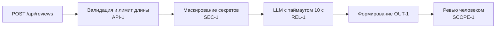

# ADR: решение для первого рабочего сценария

- Статус: proposed
- Дата: 2026-09-10
- Ответственные: команда курса, ревьюер человека

## Контекст

Учебный PR добавляет `ReviewService.review(diff)` и эндпоинт `POST /api/reviews` (см. `TRAINING_PR.diff`). По факту diff:

- `review_service.py:15` — сырой diff включается в промпт и отправляется во внешний LLM без маскирования (SEC-1 нарушен).
- `review_service.py:16` — вызов LLM без таймаута и обработки ошибок (REL-1 нарушен).
- `review_service.py:17 → api.py:9` — наружу отдаётся `{ "comment": ... }`, что не соответствует контракту OUT-1.
- `api.py:9` — нет проверки длины diff > 20 000 (API-1 нарушен) и нет валидации тела.

## Решение

Для первого рабочего сценария принять минимальный набор архитектурных ограничений на границах сервиса:

1. На уровне API валидировать тело запроса и длину `diff`; при `len(diff) > 20000` возвращать HTTP 413 (API-1), при невалидном теле — 4xx.
2. Перед вызовом LLM выполнять маскирование секретов в `diff` (SEC-1).
3. Все LLM-вызовы выполнять с таймаутом 10 секунд и контролируемым маппингом ошибок в ответ (REL-1).
4. Приводить ответ к контракту OUT-1: `summary`, `risks` (≤ 3, с `file`, `line`, `evidence`, `risk`), `checks`.

Замечание SCOPE-1: сервис только формирует совет; никаких действий в GitHub.

## Рассмотренные альтернативы

| Альтернатива | Почему не выбрали сейчас |
|---|---|
| Оставить как есть и доработать позже | Риски SEC-1/API-1/REL-1/OUT-1 подтверждены diff; откладывание повышает ущерб и стоимость изменений |
| Делегировать все проверки внешней обёртке LLM | Наличие обёртки неизвестно (см. Gaps); ответственность границы API остаётся на нашем сервисе |
| Сразу вводить сложную оркестрацию и асинхронность | Вне первого сценария; повышает сложность без влияния на подтверждённые риски |

## Последствия и главный риск

- Положительные последствия:
  - Снижение риска утечки секретов; предсказуемые тайминги; стабильный контракт OUT-1.
- Ограничения:
  - Возможное усечение/маскирование влияет на полноту анализа; 413 отсекает слишком большие диффы.
- Главный риск:
  - Ложное ощущение «полной защиты», если маскирование реализовано некачественно.
- Как проверим риск:
  - Unit-проверка с `token=TEST_SECRET` и инспекцией промпта; интеграционный тест с LLM-стабом >10 с; E2E проверки структуры ответа и 413.

## Архитектурная схема

## Как использовали AI

- Для чего: зафиксировать минимальные архитектурные решения, закрывающие подтверждённые риски из diff.
- Тип промпта: master prompt.
- Строка в [`prompts.md`](prompts.md): P1-02.
- Что проверили и исправили сами: сослались на `review_service.py:17 → api.py:9` как источник нарушения OUT-1; на `review_service.py:15–16` как источники SEC-1/REL-1; добавили проверки в «Последствиях».
