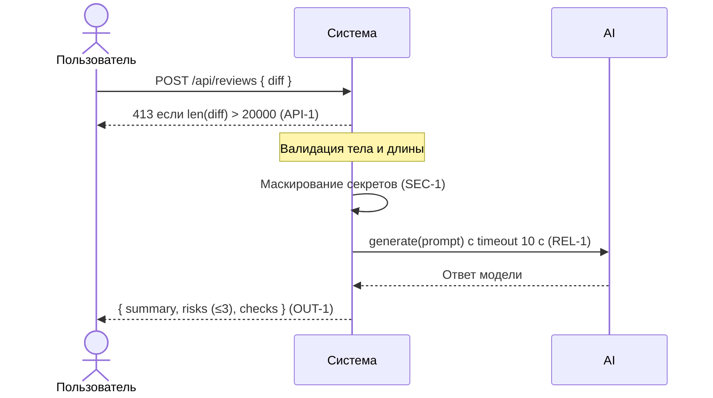

# Use cases и user stories

## Первый рабочий сценарий

Когда ревьюер отправляет дифф PR в `POST /api/reviews`, система проверяет валидность тела и длину диффа, маскирует секреты и с таймаутом обращается к LLM, формируя структурированный ответ по OUT-1, а пользователь получает краткое резюме (`summary`), до трёх доказанных рисков с привязкой к строкам (`risks`) и список проверок (`checks`) для воспроизведения.

Не входит в этот сценарий:

- approve/merge, публикация комментариев в GitHub (SCOPE-1);
- изменение кода PR за автора;
- правила вне Context Pack (например, snake_case, i18n).

## Use case

| Поле | Значение |
|---|---|
| Актор | Ревьюер PR |
| Триггер | Поступил дифф PR для проверки |
| Предусловия | Доступен эндпоинт `POST /api/reviews`; дифф не превышает 20 000 символов или система вернёт 413 |
| Основной результат | Структурированный ответ по `OUT-1`: `summary`, `risks` (≤ 3), `checks` |
| Ошибка или отказ | 400/422 при невалидном теле; 413 при диффе > 20 000 символов; контролируемая ошибка при таймауте LLM (REL-1) |



## User stories и acceptance criteria

```gherkin
Feature: Ревью диффа PR с защитой секретов и структурированным результатом

  Scenario: Позитивный ответ по OUT-1
    Given доступен эндпоинт POST /api/reviews
    And корректное тело запроса содержит поле diff длиной <= 20000 символов
    When отправляем запрос с тестовым diff без секретов
    Then ответ содержит только поля summary, risks (не более 3 элементов, каждый с file,line,evidence,risk) и checks (OUT-1)

  Scenario: Негативный — дифф слишком длинный (API-1)
    Given доступен эндпоинт POST /api/reviews
    And тело запроса содержит поле diff длиной > 20000 символов
    When отправляем запрос
    Then сервис возвращает HTTP 413 и не вызывает LLM

  Scenario: Граничный/негативный — невалидное тело
    Given доступен эндпоинт POST /api/reviews
    And тело запроса не содержит ключа diff
    When отправляем запрос
    Then сервис возвращает 4xx (400/422), а не 5xx

  Scenario: Защита секретов (SEC-1)
    Given доступен эндпоинт POST /api/reviews
    And тело запроса содержит diff со строкой token=TEST_SECRET
    When отправляем запрос
    Then в запросе к LLM секрет замаскирован (например, [REDACTED]) и не утекает в prompt
```

## Как использовали AI

- Для чего: сформировать первый рабочий сценарий и приемочные критерии на основе подтверждённых правил SEC-1, API-1, REL-1, OUT-1.
- Тип промпта: master prompt.
- Строка в [`prompts.md`](prompts.md): P1-02.
- Что проверили и исправили сами: добавили явные ссылки на правила в сценарии и acceptance; привязали возможные ответы к строкам diff `review_service.py:15–17`, `api.py:9` через соответствующие проверки.
  Scenario: Граничный — дифф ровно 20000 символов
    Given доступен эндпоинт POST /api/reviews
    And тело запроса содержит поле diff длиной == 20000 символов
    When отправляем запрос
    Then сервис возвращает HTTP 200 и вызывает LLM; ответ по OUT-1
