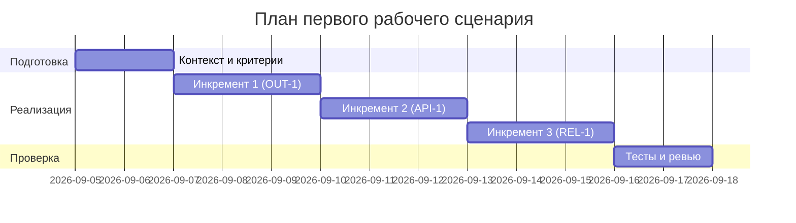

# План поставки

## Инкременты и ответственность

| Инкремент | Наблюдаемый результат | Что делает человек | Что делает AI или субагент | Проверка | Зависимости |
|---|---|---|---|---|---|
| 1 | Минимальный контракт OUT-1 на ответе | Формализует требования OUT-1, согласует с командой | Генерирует предложения структуры ответа и проверок | E2E позитивный: ответ содержит summary/risks/checks | TRAINING_PR.diff, CASE.md |
| 2 | Ограничение входа и валидация | Уточняет поведение 413 и 4xx на невалидном теле | Предлагает тестовые данные и проверки | Integration: diff > 20000 → 413; E2E негативный без diff → 4xx | Инкремент 1 |
| 3 | Надёжность LLM-вызова | Решает, как обрабатывать таймауты; утверждает SLA | Предлагает таймаут и fallback-ответ | Integration: LLM со sleep > 10 с → контролируемый ответ (REL-1) | Инкременты 1–2 |

## Диаграмма Ганта

Даты иллюстративны для домашней работы; фактические сроки уточняются командой.

## Как использовали AI

- Для чего: разложить поставку первого сценария на минимальные инкременты с проверками.
- Тип промпта: master prompt.
- Строка в [`prompts.md`](prompts.md): P1-02.
- Что проверили и исправили сами: увязали инкременты с правилами OUT-1, API-1, REL-1 и обязательными проверками; исключили действия вне SCOPE-1.
